<!-- Typing Header -->

---

### 💫 About Me

  

---

### 🛠️ Tech Stack

**Languages**  

**Frontend**  

**Backend & APIs**  

**AI & Agentic**  

**Databases & Caching**  

**Testing**  

**Cloud & DevOps**  

**Tools**  

---

### 📊 GitHub Activity & Metrics

  
  &nbsp;
  

  

  
  &nbsp;
  

---

### 👾 Contribution Arcade

<picture data-importer="pacman">
  <source media="(prefers-color-scheme: dark)" srcset="https://raw.githubusercontent.com/080abhinav/080abhinav/pacman-output/galaga-contribution-graph-dark.svg?game=galaga">
  <source media="(prefers-color-scheme: light)" srcset="https://raw.githubusercontent.com/080abhinav/080abhinav/pacman-output/galaga-contribution-graph.svg?game=galaga">
  
</picture>

---

### 🤝 Connect with Me

&nbsp;

